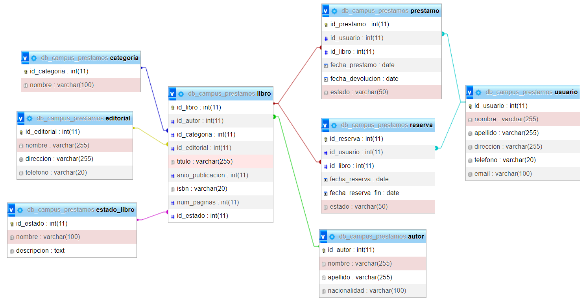

# Proyect  bibliotecaCampus

### Diagrama



### Instalaciones dependencias

Packed.json

`npm init -y`

Instalación Nodemon

`npm i -E -D nodemon`

Instalar Express

`npm i -E express`

Instalar dotenv

`npm i -E -D dotenv`

Instalar mysql2

`npm i -E -D mysql2`

Instalar nanoid

`npm i -E -D nanoid`

Instalar clase transformer

`npm i -E -D class-transformer`

Instalar reflect metadata

`npm i -E -D reflect-metadata`

Instalar typescript

`npm i -E -D typescript`

Instalar cookie-parser

`npm i -E -D cookie-parser`

Instalar class-validator

`npm i -E -D class-validator`

Instalación completa y rapida
`npm i -E -D nodemon express dotenv mysql2 nanoid cookie-parser class-transformer reflect-metadata class-validator typescript`


## Configuracion del .env

```
MY_CONFIG={"hostname": "localhost", "port":5023}
MY_CONNECT={"host":"localhost","user":"root","database":"db_campus_bliblioteca","port":3306}
```


## Configuracion del tsconfig

```
{
    "compilerOptions":{
        "target":"es6",
        "module":"ES6",
        "moduleResolution":"node",
        "outDir":"./dtocontroller",
        "esModuleInterop":true,
        "experimentalDecorators":true,
        "emitDecoratorMetadata": true
    }
}
```


## Routers

### Router autoresNaci

Se creó un router con un get que lo que hace es obtener(get) el nombre y apellido de los autores con su respecteiva nacionalidad

- http://localhost:5023/autores/nacionalidad

### Router Categorias

Se creó el archivo categorias para hacer el metodo get, de este modo obtener todas las categorias disponibles con su respectivo id

-  http://localhost:5023/categorias

### Router editoriales

Se creó el metodo get en el archivo editoriales para de este modo obtener las editoriales con sus respectivas direcciones

- http://localhost:5023/editoriales/name/dress

### Router estado_libro

Se implementó el metodo get para de este modo obtener tanto el nombre como la descripcion de los libros(estado_libro), ademas de su respectivo id para identificarlos

- http://localhost:5023/estado/libro

### Router libro

Se implementó el metodo get para poder mostrar todos los libros con su titulo, autor y editorial, para esto se implemento INNER JOIN para de esta forma buscar datos de otras tablas

- http://localhost:5023/libros/caracteristicas

### Router Prestamos

Se implementó el metodo get para de este modo listar los prestamos realizados con fecha de préstamo, fecha de devolución y estado. 

- http://localhost:5023/prestamos/fechas

### Router Reservas

Se implementó el metodo get para ver todas las reservas realizadas con su fecha de reserva, fecha devolución y estado, además del libro reservado

- http://localhost:5023/reservas

### Router librosDisponibles

Se implementó el metodo get para poder obtener con inner join los libros disponibles utilizando where igual, ademas de mostrar sus respectivos autores

- http://localhost:5023/libros/disponibles

### Router LibrosPrestados

Se implementó el metodo get para de esta forma obtener los libros prestados y su fecha de devolución, se utilizó inner join ademas del where igual

- http://localhost:5023/libros/prestados

### Router Usuarios

Se implementó el metodo get para de esta forma listar los usuarios y sus correos electrónicos.

- http://localhost:5023/usuarios/data

### Router LibrosEscritos

Se implementó el metodo get para de esta forma mostrar los libros escritos por un autor específico, utilizando el INNER JOIN ademas de WHERE igual

- http://localhost:5023/libros/escritos

### Router LibroCategoria

Se realizó el metodo get en el cual es para obtener los libros de cierta categoría, utilizando INNER JOIN y where igual

- http://localhost:5023/libros/categoria

### Router LibroPag

Se esta realizando un get par aobtener los libros que tienen numeros de paginas mayor a 500(En proceso)

- http://localhost:5023/libros/pag